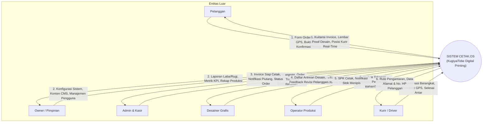
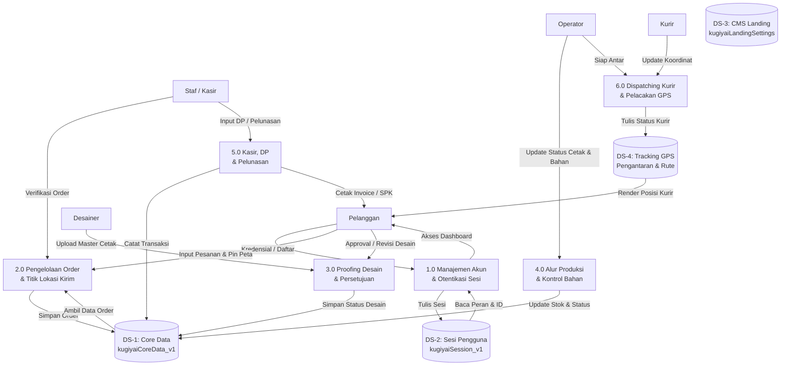
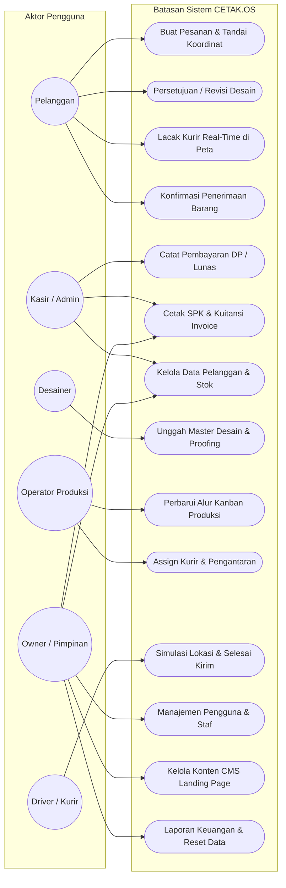
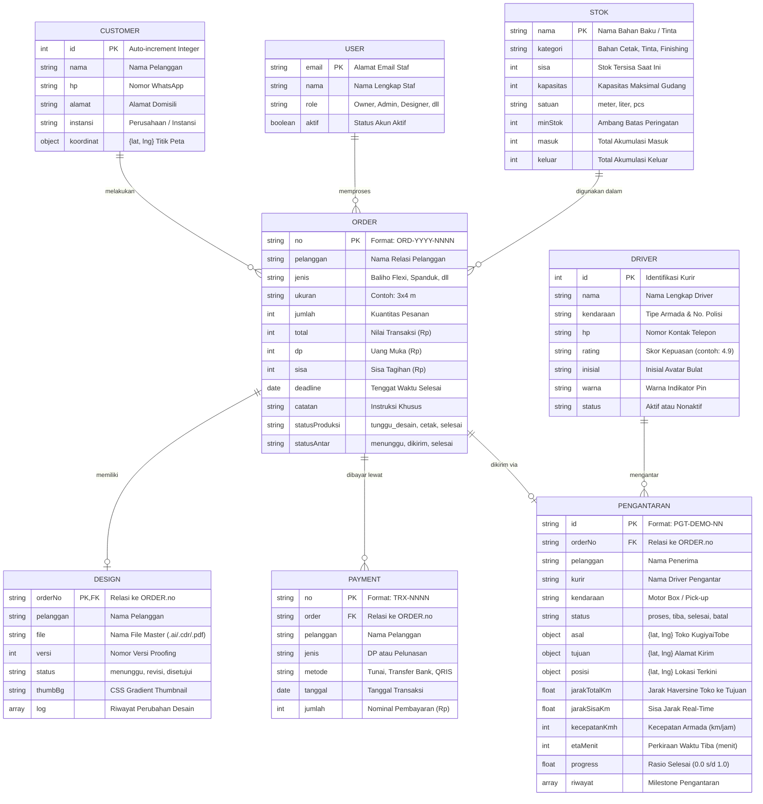
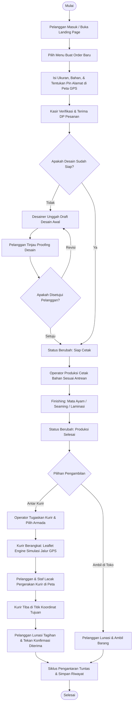
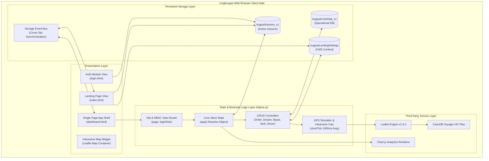
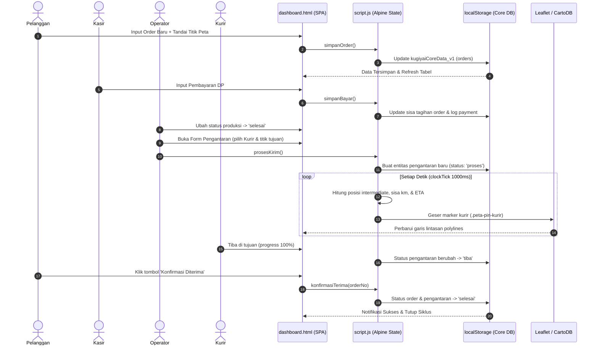

# CETAK.OS — KugiyaiTobe Digital Printing

> Sistem Informasi Manajemen Percetakan Digital, Monitoring Produksi, dan Pelacakan Pengantaran Real-Time Berbasis Web.
> **Lokasi Operasional:** Mugou · Waghete · Kabupaten Deiyai · Provinsi Papua Tengah.

---

## 📋 Daftar Isi

1. [Tentang Sistem](#-tentang-sistem)
2. [Arsitektur & Struktur Berkas](#-arsitektur--struktur-berkas)
3. [Peran Pengguna & Kontrol Akses (RBAC)](#-peran-pengguna--kontrol-akses-rbac)
4. [Analisis & Perancangan Sistem (Mermaid Diagrams)](#-analisis--perancangan-sistem-mermaid-diagrams)
   - [4.1 DFD Level 0 (Context Diagram)](#41-dfd-level-0-context-diagram)
   - [4.2 DFD Level 1 (Data Flow Diagram Terinci)](#42-dfd-level-1-data-flow-diagram-terinci)
   - [4.3 Use Case Diagram](#43-use-case-diagram)
   - [4.4 Entity Relationship Diagram (ERD)](#44-entity-relationship-diagram-erd)
   - [4.5 Flowchart Alur Operasional Bisnis](#45-flowchart-alur-operasional-bisnis)
   - [4.6 Diagram Komponen (Component Diagram)](#46-diagram-komponen-component-diagram)
   - [4.7 Sequence Diagram (Siklus Order & Pengantaran)](#47-sequence-diagram-siklus-order--pengantaran)
5. [Peta GPS & Manajemen Armada Kurir (CartoDB Voyager HD)](#-peta-gps--manajemen-armada-kurir-cartodb-voyager-hd)
6. [Skema Penyimpanan & Sinkronisasi Lintas-Halaman](#-skema-penyimpanan--sinkronisasi-lintas-halaman)
7. [Hasil Audit & Pembaruan Terakhir](#-hasil-audit--pembaruan-terakhir)
8. [Panduan Penggunaan & Uji Coba](#-panduan-penggunaan--uji-coba)

---

## 🏢 Tentang Sistem

**CETAK.OS** adalah sistem perancangan dan operasional digital-printing terpadu yang dirancang khusus untuk memenuhi kebutuhan produksi baliho flexi, spanduk vinyl, roll up banner, dan stiker cutting di **KugiyaiTobe Digital-Printing**, Waghete, Deiyai, Papua Tengah.

Aplikasi ini menggabungkan dua lingkungan kerja dalam satu ekosistem:

1. **Landing Page Publik (`index.html`)**: Katalog interaktif, showcase portofolio dinamis, kalkulator estimasi harga, running ticker pesanan, dan modal autentikasi mandiri terintegrasi.
2. **Dashboard Internal CETAK.OS (`dashboard.html`)**: Panel manajemen lengkap dengan 11 modul operasional terpadu (Order, Pelanggan, Desain Proofing, Kanban Produksi, Peta Pengantaran GPS, Manajemen Driver Armada, Keuangan/Kasir, Stok Bahan, Laporan Analitik, Manajemen Pengguna, dan CMS Landing Page).

Sistem berjalan **100% Client-Side** tanpa ketergantungan server runtime backend (zero-backend architecture), memanfaatkan kekuatan **Alpine.js reaktif**, **HTML5 Web Storage**, dan **Leaflet.js HD Maps**.

---

## 📂 Arsitektur & Struktur Berkas

```
percetakan_baliho/
├── index.html                 # Landing page promosi & katalog publik
├── login.html                 # Halaman autentikasi mandiri & quick-demo switch
├── dashboard.html             # Single-Page Application (SPA) manajemen CETAK.OS
├── README.md                  # Dokumentasi teknis & perancangan sistem
├── asset/
│   ├── css/
│   │   ├── style.css          # Desain landing page & custom pin peta Leaflet
│   │   ├── dashboard.css      # Tema gelap, kartu glassmorphism, & layout dashboard
│   │   ├── tailwind.built.css # Tailwind CSS utilities build
│   │   └── bootstrap.min.css  # Grid system & modal scaffolding
│   ├── js/
│   │   ├── script.js          # Core business logic Alpine.js & simulasi real-time
│   │   ├── alpine.min.js      # Alpine.js framework reaktif v3
│   │   ├── bootstrap.bundle.min.js # Bootstrap UI engine (Modal, Dropdown, Offcanvas)
│   │   └── chart.min.js       # Chart.js library visualisasi analitik
│   └── img/
│       ├── banner-ticket/     # Asset tiket banner preview HD (ticket-1 s/d ticket-6)
│       └── gallery/           # Asset portofolio cetak real (gallery-1 s/d gallery-6)
```

---

## 👥 Peran Pengguna & Kontrol Akses (RBAC)

Aplikasi menerapkan sistem **Role-Based Access Control (RBAC)** ketat untuk memastikan integritas data operasional:

| Peran (Role)          | Hak Akses & Tanggung Jawab Utama                                                                                                                                                      |
| --------------------- | ------------------------------------------------------------------------------------------------------------------------------------------------------------------------------------- |
| **Owner (Pimpinan)**  | Akses seluruh modul sistem tanpa batasan, manajemen pengguna & peran staf, reset basis data, serta CMS Landing Page.                                                                  |
| **Admin**             | Pengelolaan order masuk, registrasi pelanggan, kontrol inventaris bahan/tinta, serta rekapitulasi laporan pendapatan.                                                                 |
| **Designer**          | Pengunggahan file master cetak (`.ai`, `.cdr`, `.pdf`), manajemen revisi desain, pembuatan proof-sheet visual.                                                                        |
| **Operator Produksi** | Pembaruan status kanban produksi (_Tunggu Desain_ → _Tunggu Setuju_ → _Siap Cetak_ → _Cetak_ → _Finishing_ → _Selesai_), penugasan kurir.                                             |
| **Kasir**             | Penerimaan pembayaran uang muka (DP), pelunasan sisa tagihan, pencetakan Surat Perintah Kerja (SPK) & kuitansi faktur.                                                                |
| **Driver (Kurir)**    | Menerima daftar pengantaran, navigasi peta CartoDB Voyager HD menuju koordinat pelanggan, konfirmasi status tiba.                                                                     |
| **Pelanggan**         | Akses dibatasi ke data miliknya sendiri (_Self-Service Portal_): buat order baru + penentuan koordinat kirim, review & setujui desain, pantau progress cetak, dan lacak posisi kurir. |

---

## 📊 Analisis & Perancangan Sistem (Mermaid Diagrams)

### 4.1 DFD Level 0 (Context Diagram)

Diagram konteks mendefinisikan batasan sistem CETAK.OS beserta entitas luar yang berinteraksi secara langsung:



---

### 4.2 DFD Level 1 (Data Flow Diagram Terinci)

DFD Level 1 menguraikan sistem menjadi 6 proses utama dan 4 lumbung data (_data stores_):



---

### 4.3 Use Case Diagram

Diagram use case memetakan hubungan antara berbagai aktor sistem dengan fungsionalitas aplikasi:



---

### 4.4 Entity Relationship Diagram (ERD)

Struktur relasi data dalam basis data `kugiyaiCoreData_v1`:



---

### 4.5 Flowchart Alur Operasional Bisnis

Bagan alur terintegrasi dari pelanggan membuat order hingga kurir menyerahkan pesanan:



---

### 4.6 Diagram Komponen (Component Diagram)

Arsitektur modular aplikasi front-end pada peramban web:



---

### 4.7 Sequence Diagram (Siklus Order & Pengantaran)

Interaksi sekuensial antar-komponen saat order diproses dan diantar:



---

## 🗺️ Peta GPS & Manajemen Armada Kurir (CartoDB Voyager HD)

Seluruh peta dalam aplikasi menggunakan pustaka **Leaflet.js** yang telah ditingkatkan ke layer tile **CartoDB Voyager HD**:

```
https://{s}.basemaps.cartocdn.com/rastertiles/voyager/{z}/{x}/{y}{r}.png
Subdomains: ['a', 'b', 'c', 'd'] | Max Zoom: 19
```

### Keunggulan & Konfigurasi Tile:

- **Tampilan Tajam & Modern**: Memiliki kontras tinggi, visual jalan bersih, serta render label toponimi wilayah Papua Tengah yang presisi.
- **Marker Kustom CSS Interaktif**:
  - `Pin Toko`: Warna merah tua aksen logo KugiyaiTobe (`.peta-pin-toko`).
  - `Pin Kurir`: Ikon motor/mobil dinamis dengan label nama kurir (`.peta-pin-kurir`).
  - `Pin Tujuan Pelanggan`: Pin lokasi tujuan dengan efek pulsing radar (`.peta-pin-tujuan`).
- **Validasi Wajib Koordinat**: Pengantaran **hanya dapat dimulai** apabila titik koordinat tujuan telah dipilih secara pasti melalui Map Picker interaktif atau lokasi tersimpan pelanggan.

---

## 💾 Skema Penyimpanan & Sinkronisasi Lintas-Halaman

Aplikasi menggunakan skema **Dual-Format Session & Storage Engine** untuk memastikan integrasi mulus antara `index.html`, `login.html`, dan `dashboard.html`:

| Storage Key                      | Lingkup          | Format Data & Keterangan                                                                                                                                                    |
| -------------------------------- | ---------------- | --------------------------------------------------------------------------------------------------------------------------------------------------------------------------- |
| `kugiyaiCoreData_v1`             | `localStorage`   | Menyimpan 8 koleksi utama: `customers`, `orders`, `designs`, `payments`, `stok`, `users`, `pengantaran`, `kurirAktif`.                                                      |
| `kugiyaiSession_v1`              | `localStorage`   | **Dual-Format Object**: Menyimpan properti `loginRole` & `loginUserName` (untuk script.js) sekaligus `role`, `user`, & `username` (untuk login.html dan navbar index.html). |
| `kugiyaiLandingSettings`         | `localStorage`   | Menyimpan 30 atribut konfigurasi landing page CMS (hero, banner slideshow, promosi, galeri, layanan, testimoni, harga).                                                     |
| `kugiyaiLandingSettingsSyncedAt` | `localStorage`   | Timestamp pemicu event `storage` browser untuk sinkronisasi realtime lintas tab.                                                                                            |
| `kugiyaiAuthPrefill`             | `sessionStorage` | Payload serah-terima satu-kali pakai dari formulir auth `index.html` ke dashboard.                                                                                          |

---

## 🔍 Hasil Audit & Pembaruan Terakhir

Pada pembaharuan versi final ini, telah diselesaikan audit kode menyeluruh dengan rincian perbaikan sebagai berikut:

1. ✅ **Sinkronisasi Skema Sesi Lintas Berkas**: `saveSession()` dan `loadSession()` di `script.js` kini mendukung skema ganda, mencegah sesi pengguna reset ke default saat berpindah halaman.
2. ✅ **Normalisasi Tipe Data ID Pelanggan**: Pembuatan akun di `login.html` telah diperbaiki dari string acak (`CST-...`) menjadi _numeric auto-increment_ yang konsisten dengan `script.js`, mencegah _bug_ kalkulasi `NaN`.
3. ✅ **Fallback Penuh Gambar GitHub Pages**: `index.html` kini dibekali objek `LANDING_DEFAULTS` lengkap sehingga portofolio galeri dan banner ticket tetap tampil sempurna di perangkat baru yang belum memiliki riwayat `localStorage`.
4. ✅ **Standardisasi Konstanta CMS**: `CMS_KEY` dan `CMS_SYNC_KEY` telah didokumentasikan dan diikat ke konstanta baku di awal `script.js`.
5. ✅ **Navbar Auth Overlay**: Tautan masuk pada navbar `index.html` kini otomatis membuka modal interaktif saat belum login, dan langsung mengarahkan ke dashboard jika sesi sudah aktif.
6. ✅ **Tampilan Hero Typography**: Penekanan visual `<em>tajam,</em>` pada judul hero dipertahankan secara utuh pada template dinamis.

---

## 🚀 Panduan Penggunaan & Uji Coba

1. **Menjalankan Proyek**:
   - Cukup buka file `index.html` atau `dashboard.html` langsung menggunakan web browser modern (Google Chrome, Microsoft Edge, Mozilla Firefox, atau Safari).
   - Tidak memerlukan Node.js, Python server, database server, maupun build command tambahan.

2. **Mencoba Berbagai Peran Pengguna**:
   - Buka menu profil di pojok kiri bawah dashboard (`@click="openModalProfil()"`).
   - Pada bagian **Simulator Peran**, klik tombol peran yang diinginkan (_Owner_, _Admin_, _Designer_, _Operator_, _Kasir_, atau _Pelanggan_).
   - Antarmuka navigasi dan hak akses akan langsung beradaptasi secara dinamis.

3. **Menguji Lacak Pengantaran**:
   - Masuk sebagai Operator Produksi atau Admin.
   - Buka menu **Pemesanan**, pilih pesanan yang berstatus produksi **Selesai**.
   - Klik tombol **"Kirim untuk Diantar"**, tentukan kurir dan pastikan titik koordinat tujuan dipilih di peta.
   - Buka menu **Lacak Pengantaran** untuk melihat animasi pergerakan kurir secara real-time.
